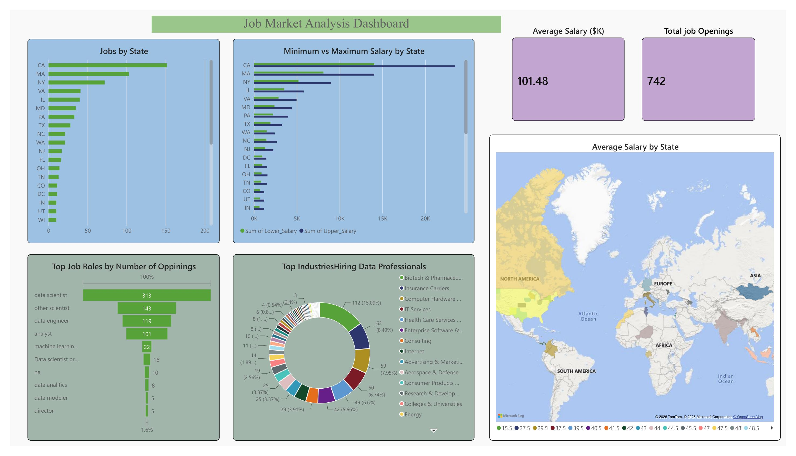
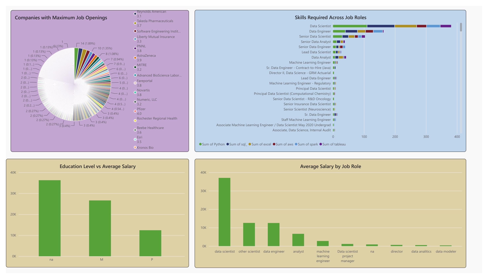

# Job Market Analysis Dashboard

> An interactive Power BI dashboard analyzing the US data professional job market — covering salary trends, top hiring roles, in-demand skills, industry breakdown, and geographic distribution of opportunities.

---

## 📊 Dashboard Preview

### Page 1 — Jobs, Salaries & Industry Overview


### Page 2 — Skills, Companies & Education Insights


---

## 🎯 Project Objective

This project explores the US data professional job market to answer key questions:
- Which states have the most job openings for data professionals?
- What are the average, minimum, and maximum salaries by state and role?
- Which job roles are most in-demand?
- Which industries are hiring the most data professionals?
- What skills (Python, SQL, Excel, AWS, Spark, Tableau) are most required?
- How does education level impact average salary?
- Which companies have the most openings?

---

## 📁 Dataset

| Attribute | Details |
|-----------|---------|
| Source | US Data Professional Jobs Dataset |
| Scope | Data Scientist, Data Analyst, Data Engineer, ML Engineer roles |
| Total Job Openings | 742 |
| Average Salary | $101.48K |
| Geography | US states (CA, MA, NY, VA, IL and more) |
| Fields | Job title, company, industry, state, salary range, required skills, education level |

---

## 🛠️ Tools & Technologies

| Tool | Purpose |
|------|---------|
| **Microsoft Power BI** | Dashboard creation and interactive visualizations |
| **DAX** | Calculated measures (average salary, job counts, skill aggregation) |
| **Power Query** | Data transformation and cleaning |
| **Bing Maps** | Geographic salary distribution visual |

---

## 📈 Dashboard Pages

### Page 1 — Market Overview
- **KPI Cards:** Average Salary ($101.48K) | Total Job Openings (742)
- **Jobs by State** — Horizontal bar chart (CA leads with 200+ openings)
- **Minimum vs Maximum Salary by State** — Grouped bar comparison (MA highest max salary)
- **Top Job Roles by Number of Openings** — Bar chart (Data Scientist: 313, Data Engineer: 119, Analyst: 101)
- **Top Industries Hiring Data Professionals** — Donut chart (Biotech & Pharma leads at 15%)
- **Average Salary by State** — Choropleth map (geographic heatmap)

### Page 2 — Skills, Companies & Education
- **Companies with Maximum Job Openings** — Sunburst/donut chart
- **Skills Required Across Job Roles** — Stacked bar (Python, SQL, Excel, AWS, Spark, Tableau)
- **Education Level vs Average Salary** — Column chart (Masters earns more than Bachelors)
- **Average Salary by Job Role** — Bar chart (Data Scientist earns the most at ~$37K avg in dataset)

---

## 🔍 Key Findings

| Finding | Insight |
|---------|---------|
| 📍 Top State | **California** has 200+ job openings — #1 in the US |
| 💰 Average Salary | **$101.48K** across all data professional roles |
| 👨‍💻 Most In-Demand Role | **Data Scientist** — 313 openings (42% of total) |
| 🏭 Top Hiring Industry | **Biotech & Pharma** — 15% of all openings |
| 🔧 Most Required Skill | **Python** — demanded across almost all senior roles |
| 🎓 Education Impact | Masters degree holders earn significantly more than Bachelors |
| 🏢 Top Hiring Companies | Pharma and healthcare companies dominate (AstraZeneca, Pfizer, Novartis) |
| 💵 Highest Salary State | **Massachusetts** — highest maximum salary range |

---

## 💡 Key Insights for Aspiring Data Professionals

1. **Learn Python first** — it is required across Data Scientist, Data Engineer, and Analyst roles
2. **SQL is non-negotiable** — appears in skill requirements across all role levels
3. **California and Massachusetts** are the top 2 states for data jobs and salaries
4. **Biotech/Pharma and IT Services** are the biggest industry employers for data talent
5. **Masters degree** provides a measurable salary advantage in the data field
6. **Data Scientist** is the most advertised role — but **Data Analyst** is the most accessible entry point

---

## 📂 Repository Structure

```
Job-Market-Analysis/
│
├── job_market_page_1.jpg                    # Dashboard screenshot - Overview page
├── job_market_page_2.jpg                    # Dashboard screenshot - Skills & Companies page
├── Job_Market_Analysis_Presentation.pptx   # Project presentation slides
└── README.md
```

---

## 🚀 How to View

- **Power BI Dashboard:** Open the `.pbix` file in Microsoft Power BI Desktop (free download)
- **Presentation:** Open `Job_Market_Analysis_Presentation.pptx` for the slide deck summary
- Screenshots of all dashboard pages are included above for quick preview

---

## 👤 Author

**Korupolu Pradeep Kumar**  
MBA Finance | Aspiring Data Analyst  
📧 korupolupradeepkumar@gmail.com  
🔗 [LinkedIn](https://linkedin.com/in/korupolu-pradeep-kumar)  
🐙 [GitHub](https://github.com/Pradeepkumark7)

---

## 🏷️ Tags

`Power BI` `Data Analytics` `Job Market Analysis` `DAX` `Business Intelligence` `Salary Analysis` `Skills Analysis` `Data Science` `MBA Finance`
